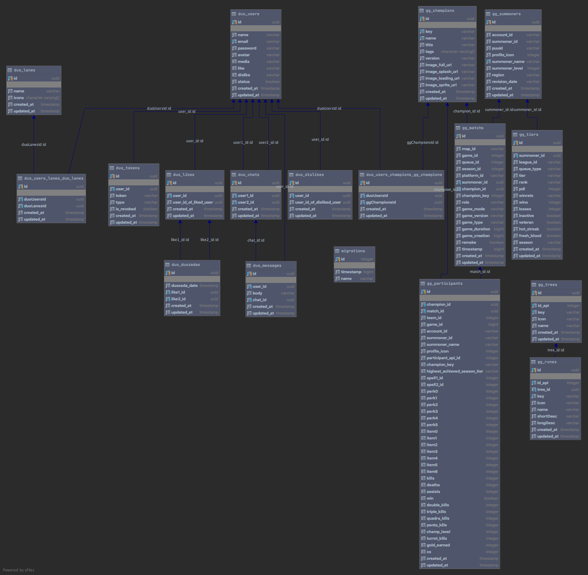

<h1 align="center">
    
</h1>

<h4 align="center">
  👭 DUO API Docs 📕
</h4>

  

  
  
  

  

  

  <a href="#-escopo-e-metodologias">📰 Escopo e Metodologias</a>&nbsp;&nbsp;&nbsp;|&nbsp;&nbsp;&nbsp;
  <a href="#-requisitos-e-regras">🖋 Requisitos e Regras</a>&nbsp;&nbsp;&nbsp;|&nbsp;&nbsp;&nbsp;
  <a href="#-diagramas">📊 Diagramas</a>&nbsp;&nbsp;&nbsp;|&nbsp;&nbsp;&nbsp;
  <a href="#-mer">🎲 MER</a>

 

## 📰 Escopo e Metodologias

- Confira todo o escopo e metodologias usadas no nosso projeto lá na nossa [wiki](https://github.com/Dale-gg/DUO-DuozadaAPI/wiki) page. 🤓

## 🖋 Requisitos e Regras

#### Requisitos funcionais

| Requisitos funcionais | Descrição                                                                                                                                                                                |
| --------------------- | ---------------------------------------------------------------------------------------------------------------------------------------------------------------------------------------- |
| RF 1                  | O sistema deve permitir o cadastro de usuários.                                                                                                                                          |
| RF 2                  | O sistema deve permitir que um usuário já cadastrado faça o login na plataforma.                                                                                                         |
| RF 3                  | O sistema deve permitir que um usuário recupere sua senha.                                                                                                                               |
| RF 4                  | O sistema deve permitir a visualização e a alteração do perfil.                                                                                                                          |
| RF 5                  | O sistema deve permitir que um usuário pesquise por Invocadores dentro da aplicação.                                                                                                     |
| RF 6                  | O sistema deve permitir a visualização do histórico de partidas assim como todas as informações de cada uma.                                                                             |
| RF 7                  | O sistema deve permitir a visualização do histórico de um jogador em relação as partidas jogadas: total de partidas, total vitórias, total derrotas, etc.                                |
| RF 8                  | O sistema deve permitir a visualização do histórico de um jogador em relação aos campeões jogados: campeão mais jogado, campeão menos jogado, campeão com melhor índice de vitória, etc. |
| RF 9                 | O sistema deve permitir que um usuário cadastre suas melhores Jogadas em seu perfil .                                                                                                    |
| RF 10                 | O sistema deve permitir que um usuário possa encontrar e detalhar o perfil de outros jogadores.                                                                                          |
| RF 11                 | O sistema deve permitir que um usuário possa dar um Like no perfil de outros usuários.                                                                                                  |
| RF 12                 | O sistema deve permitir que um usuário possa dar um Dislike no perfil de outros usuários.                                                                                                  |
| RF 13                 | O sistema deve permitir que aconteça um match (Duozada) entre dois usuários.                                                                                                                       |
| RF 14                 | O sistema deve permitir que os usuários conversem via Chat após ocorrer um match (Duozada).                                                                                                        |

#### Regras de negócio

| Regras de Negócio | Descrição                                                                                                                                                         |
| ----------------- | ----------------------------------------------------------------------------------------------------------------------------------------------------------------- |
| RN 1              | O usuário deverá fazer um primeiro cadastro fornecendo informações básicas, e algumas informações do jogo como, 3 CAMPEÕES que mais joga e 2 ROTAS que mais joga. |
| RN 2              | O usuário só podera fazer edições no seu perfil caso esteja autenticado.                                                                                          |
| RN 3              | O usuário podera recuperar sua senha e confirmar sua conta via token no email.                                                                                    |
| RN 4              | O usuário podera fazer requisições a API da Riot sem estar autenticado.                                                                                           |
| RN 5              | O usuário deve fazer as requisições a API da Riot pelo nome de algum Invocador apenas.                                                                            |
| RN 6              | O usuário podera atualizar o perfil de algum Invocador, para refazer a requisição a API da Riot.                                                                  |
| RN 7              | O usuário deverá estar logado na aplicação para utilizar os recursos do Duozada.                                                                                  |
| RN 8              | O sistema deve fornecer para o usuário a opção de cadastrar suas melhores Jogadas quando acessar o Duozada, ou pular a opção.                                     |
| RN 9              | O usuário podera listar e detalhar o perfil de outros jogadores na plataforma, assim como suas Jogadas.                                                           |
| RN 10             | O usuário podera dar um Like no perfil de outros jogadores, caso o outro jogador tambem de um like no perfil do mesmo, ira ocorrer um Match.                      |
| RN 11             | Apenas após um Match, os usuários teram a opção de conversarem via Chat dentro da aplicação.                                                                      |
| RN 12             | Um User que estiver com seu status setado como false, não poderá acessar a aplicação                                                                              |

#### Requisitos não funcionais tecnologicos

| Requisitos funcionais não tecnologicos | Descrição                                                                                                         |
| -------------------------------------- | ----------------------------------------------------------------------------------------------------------------- |
| RNFT 1                                 | Um script será criado para realizar um pré cadastro dos Campeões e Lanes na aplicação.                             |
| RNFT 2                                 | O sistema deve fazer uso da API da Riot Games para buscar as informações dos Invocadores.                         |
| RNFT 3                                 | O banco de dados a ser utilizado terá o padrão objeto-relacional.                                                 |
| RNFT 4                                 | A aplicação irá usar o architectural pattern MVC.                                                                 |
| RNFT 5                               | O chat de texto pós match será implementado usando socket.io.                                                     |
| RNFT 6                              | O sistema vai usar a lib ZedJS para fazer request a API da Riot Games |
| RNFT 7                             | O sistema vai usar a lib dedSec para padronizar respostas para o client |
| RNFT 8                           | O sistema vai usar o pattern Observable para lidar com o cadastro de Summoners

## 📊 Diagramas

<b>
  <h3 align="center">
      Casos de uso
  </h3>
</b>

<h1 align="center">
    
    
</h1>

<b>
  <h3 align="center">
      Classes
  </h3>
</b>

<h1 align="center">
    
</h1>

## 🎲 MER

<h1 align="center">
    
</h1>

---

Made with 🖤 by [jlenon7](https://github.com/jlenon7) & [Adryell](https://github.com/adryell):wave:
