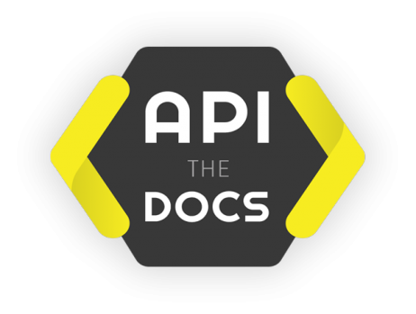

<h1 align="center">
    
</h1>

<h4 align="center">
  🀄️ Organization Docs 👨🏻‍🚀
</h4>

  

  
  
  

  

  

  <a href="#-projects">🖥 Projects</a>

 

# 🖥 Projects

In this repository we concentrate all the documentation of all our **domains/services**, each one of them has a specific **prefix**.

## DUO - Duozada

Access the docs of [Duozada](htttps://github.com/Dale-gg/docs/DUO)

## GG - Dale.gg

Access the docs of [Dale.gg](htttps://github.com/Dale-gg/docs/GG)

## DUOGG-MIG - Migrations of Duozada and Dale.gg

Access the docs of [Migrations](htttps://github.com/Dale-gg/docs/DUOGG-MIG)

---

Made with 🖤 by [jlenon7](https://github.com/jlenon7) & [Adryell](https://github.com/adryell):wave:
